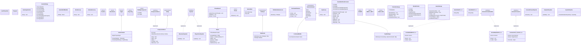

```mermaid
classDiagram

class Cp437Symbols {

}

class Program {

}

class GameApplication {
  +Run() void
}

class GameSettings {
  +string MapPath
  +int ScreenWidth
  +int ScreenHeight
  +int SimulationFps
  +int RenderFps
  +int InputPollMs
  +int CommandQueueCapacity
  +int PlayerStartX
  +int PlayerStartY
}

class GameWorldBuilder {
  +Build() World
}

class RenderLoop {
  +Run() void
}

class SimulationLoop {
  +Run() void
}

class Position {
  <<struct>>
}

class MoveIntent {
  <<struct>>
}

class Glyph {
  <<struct>>
}

class PlayerTag {
  <<struct>>
}

class TileMapComponent {
  <<struct>>
  +int Width
  +int Height
}

class GameContent {
  +Glyph PlayerGlyph
  +CreatePalette() TilePalette
  +CreateKeyBindings() KeyBindings
}

class IComponentStore {
  <<interface>>
}

class ComponentStore {
  +int Count
  +IReadOnlyCollection~Entity~ Entities
  +Has() bool
  +Set() void
  +Get() T
  +TryGet() bool
  +Remove() void
}

class Entity {
  <<record struct>>
}

class ISystem {
  <<interface>>
}

class ThreadGuard {
  +AttachToCurrentThread() void
  +Validate() void
  +Enter() Scope
}

class Scope {
  <<struct>>
  +Dispose() void
}

class World {
  +ThreadGuard Guard
  +CreateEntity() Entity
  +Store() ComponentStore~T~
  +Add() void
  +Query() Entity[]
  +Resource() T
  +SetResource() void
}

class CommandBuffer {
  +List~GameCommand~ Items
}

class GameState {
  +bool IsRunning
  +long Tick
}

class KeyBindings {
  +Dictionary~ConsoleKey, GameCommand~ Map
}

class TileStyle {
  <<record struct>>
}

class TilePalette {
  +Dictionary~char, TileStyle~ Tiles
  +TileStyle Fallback
}

class TilePaletteExtensions {
  +Resolve() TileStyle
}

class CommandChannel {
  +Post() void
  +DrainTo() void
  +Close() void
}

class GameCommand {
  <<enumeration>>
  None
  MoveUp
  MoveDown
  MoveLeft
  MoveRight
  Exit
}

class InputLoop {
  +Run() void
}

class DoubleBufferedConsole {
  +int Width
  +int Height
  +ConsoleColor DefaultForeground
  +ConsoleColor DefaultBackground
  +AttachToCurrentThread() void
  +PutChar() void
  +Draw() void
  +Clear() void
  +Fill() void
  +FillRect() void
  +Resize() void
  +Dispose() void
}

class COORD {
  <<struct>>
}

class SMALL_RECT {
  <<struct>>
}

class CHAR_INFO {
  <<struct>>
}

class FrameExchange {
  +T WriteBuffer
  +AttachWriter() void
  +AttachReader() void
  +Publish() void
  +TryAcquireFresh() bool
}

class RenderFrame {
  +int Width
  +int Height
  +char[] Symbols
  +ConsoleColor[] Foreground
  +ConsoleColor[] Background
  +long Tick
}

class GameStorage {
  +RegisterHandler() void
  +RegisterConverter() void
  +Save() void
  +Load() (Version Version, object Data)
  +ConvertStep() object
  +LoadAndConvert() T
}

class GameDataV0_0_0 {
  +char[,] Map
}

class GameDataV0_0_1 {
  +char[,] Map
}

class IVersionFormatHandler {
  <<interface>>
}

class IVersionConverter {
  <<interface>>
}

class FormatHandlerV0_0_0 {
  +Version Version
  +Save() void
  +Load() object
}

class FormatHandlerV0_0_1 {
  +Version Version
  +Save() void
  +Load() object
}

class ConverterV0_0_0ToV0_0_1 {
  +Version SourceVersion
  +Version TargetVersion
  +Convert() object
}

class ConsolePresentSystem {
  +Present() void
}

class MovementSystem {
  +Update() void
}

class PlayerIntentSystem {
  +Update() void
}

class SnapshotSystem {
  +Update() void
}

class SystemPipeline {
  +CreateSimulationSystems() ISystem[]
}

Glyph <-- GameContent
IComponentStore <|.. ComponentStore : implements
Entity <-- ComponentStore
ThreadGuard <-- World
GameCommand <-- CommandBuffer
GameCommand <-- KeyBindings
TileStyle <-- TilePalette
IVersionFormatHandler <|.. FormatHandlerV0_0_0 : implements
IVersionFormatHandler <|.. FormatHandlerV0_0_1 : implements
IVersionConverter <|.. ConverterV0_0_0ToV0_0_1 : implements
ISystem <|.. MovementSystem : implements
ISystem <|.. PlayerIntentSystem : implements

```
